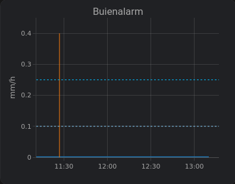

# HomeAssistant precipitation sensors and graph

Created this for my own use, because I wasn't happy with the available options.

Note that data is used from [buienalarm](https://www.buienalarm.nl), I have no connection whatever with buienalarm, just using the open api as made available by buienalarm. However, it can be extended to eg [buienradar](https://www.buienradar.nl), so the setup is not limited to buienalarm.

**This is working on my homeassistant environment, that's it. Shared for tesing and usage at your own risk!**

**Installation requires copying files to your homeassistant configuration and updating home assistant configuration, so some homeassistant knowledge is required**

# Installation
This setup adds a [RESTful integration](https://www.home-assistant.io/integrations/rest/) to your homeassistant, polling the api every 5mins. To make the data visible I added a plotly graph showing sort of the same chart as the buienalarm app.

## Setup of Sensors 
Copy `buienalarm.yaml` and ensure the file is read from your `configuration.yaml`. Eg, drop the file in `/config/packages` and use the config lines below to include the `packages` directory:

```yaml
homeassistant:
  packages: !include_dir_named packages
```

And reboot your homeassistant instance. 

The integration will automatically use you Home zone `zone.home` location to pull in api data.

Adding the file in your config creates sensors:

Sensor|Attribute|Unit|Comment
--|--|--|--
`sensor.buienalarm_precipitation_intensity`|n.a.|mm/h|the sensor itself holds the precipitation intensity, attributes hold the api data
`sensor.buienalarm_precipitation_intensity`|`precip`|n.a.|table with precipitation values per period `delta`
`sensor.buienalarm_precipitation_intensity`|`start`|timestamp|start time of `precip` table
`sensor.buienalarm_precipitation_intensity`|`delta`|seconds|measumerment period of `precip` table
`sensor.buienalarm_precipitation`|n.a.|mm|precipitation in mm in `delta` period
`sensor.buienalarm_precipitation_expected`|n.a.|Bool|returns True when rain expected next 4 to 6 `delta` periods

## Setup of Graph
The chart is plotted using [plotlygrap](https://github.com/dbuezas/lovelace-plotly-graph-card). This plugin can be installed using [HACS](https://hacs.xyz) if not already avaible.

Next copy text from this `plotlygraph.yaml` and drop this in a manual card on any of your dashboards and you are done.


")

